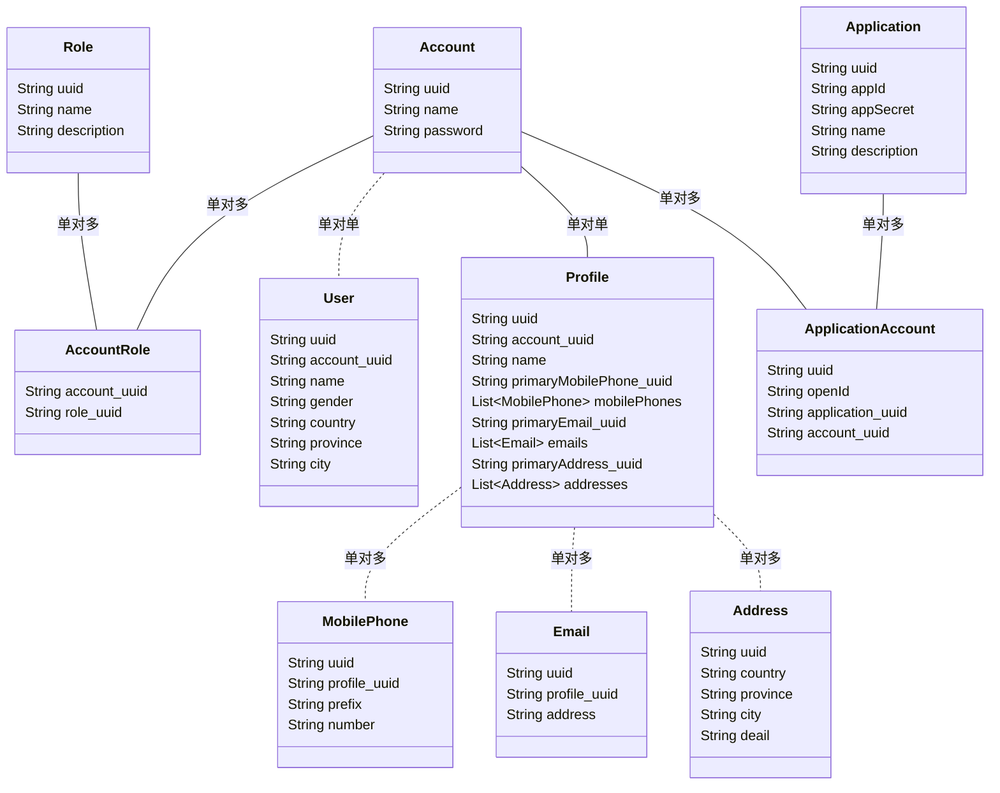

# 架构

## 数据结构关系图表：

```mermaid
classDiagram
	class Account{
		String uuid
		String name
		String password
	}
	
	
	class Role{
		String uuid
		String name
		String description
	}
	
	class AccountRole {
		String account_uuid
		String role_uuid
	}
	
	Account -- AccountRole :单对多
    Role -- AccountRole :单对多
	
	class User {
		String uuid
		String account_uuid
		String name
		String gender
		String country
		String province
		String city
	}
	
	Account .. User :单对单
	
	class Profile {
		String uuid
		String account_uuid
		String name
		String primaryMobilePhone_uuid
		List~MobilePhone~ mobilePhones
		String primaryEmail_uuid
		List~Email~ emails
		String primaryAddress_uuid
		List~Address~ addresses
	}
	
	Account -- Profile :单对单
	
	class MobilePhone {
		String uuid
		String profile_uuid
		String prefix
		String number
	}
	
	Profile .. MobilePhone :单对多

	
	class Email {
		String uuid
		String profile_uuid
		String address
	}
	
	Profile .. Email :单对多

	
	class Address {
		String uuid
		String country
		String province
		String city
		String deail
	}
	
	Profile .. Address :单对多
	
	class Application {
		String uuid
		String appId
		String appSecret
		String name
		String description
	}
	
	class ApplicationAccount {
		String uuid
		String openId
		String application_uuid
		String account_uuid
	}
	
	Application -- ApplicationAccount :单对多
	Account -- ApplicationAccount :单对多
	
	
	
	
	
	
		
	
```

